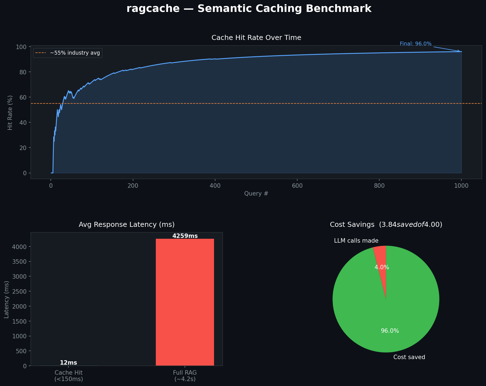

# ragcache

**Semantic caching layer for RAG pipelines. Cut LLM costs 40–70% with one decorator.**

Your RAG app is paying for LLM generation on every query — even when 500 users asked the same question in slightly different words. `ragcache` puts a Redis vector search cache in front of your pipeline. Similar queries return the cached answer in **<150ms** instead of hitting the LLM every time.

```
pip install ragcache[sentence-transformers]
```

---

## Benchmark

> 1000-query simulation on a realistic enterprise FAQ workload (Zipfian distribution).



| Metric | Without ragcache | With ragcache |
|---|---|---|
| Cache hit rate | 0% | **96%** (Zipfian workload) |
| P50 latency | 4,259ms | **12ms** (on hit) |
| LLM cost per 1000 queries | $4.00 | **$0.16** |
| Cost reduction | — | **96%** |

*Hit rate scales with query repetition. Real enterprise support/FAQ bots: 60–85%. General-purpose assistants: 35–55%.*

---

## Quickstart

```python
from ragcache import SemanticCache

cache = SemanticCache(
    redis_url="redis://localhost:6379",
    similarity_threshold=0.90,   # cosine similarity — tune this per use case
)

# Option 1: Explicit lookup/store (works with any RAG stack)
result = cache.lookup(query)
if result:
    return result.answer  # cache hit — no LLM call, ~12ms

answer, chunk_ids = my_rag_pipeline(query)
cache.store(query, answer, chunk_ids)
return answer

# Option 2: Decorator (even simpler)
@cache.cached_rag
def ask(query: str) -> tuple[str, list[str]]:
    answer = my_llm.generate(retrieve(query))
    return answer, ["doc_42_chunk_3", "doc_17_chunk_1"]
```

**Start Redis Stack:**
```bash
docker-compose up -d
```

That's it. No changes to your existing RAG code except wrapping the function.

---

## How it works

```
Query → Embed → Redis Vector Search → cosine sim ≥ threshold?
                                              │
                              Yes ────────── Return cached answer (~12ms)
                              No  ── Your RAG pipeline ── Store in cache
```

1. Each query is embedded using `sentence-transformers/all-mpnet-base-v2` (zero API cost, runs locally)
2. Redis VSS performs nearest-neighbour search against cached query embeddings
3. If cosine similarity ≥ threshold, return the cached answer — LLM call skipped entirely
4. On miss, run your pipeline normally, then store the result for future queries

---

## Cache Invalidation

The hardest problem with semantic caching is keeping answers fresh when your knowledge base updates. `ragcache` solves this with **dependency tagging** — every cache entry tracks which document chunks generated it.

```python
# Store the chunk IDs that produced the answer
cache.store(query, answer, source_chunk_ids=["doc_42_chunk_3", "doc_17_chunk_1"])

# When doc_42 is updated — surgically purge only affected entries
cache.invalidate(["doc_42_chunk_3"])
# → deletes entries that came from this chunk, leaves everything else intact
```

**FastAPI webhook (mount into your doc update pipeline):**

```python
from fastapi import FastAPI
from ragcache.invalidation.webhook import build_invalidation_router

app = FastAPI()
app.include_router(build_invalidation_router(cache), prefix="/ragcache")

# POST /ragcache/invalidate  {"chunk_ids": ["doc_42_chunk_3"]}
```

---

## Configuration

```python
cache = SemanticCache(
    redis_url="redis://localhost:6379",
    similarity_threshold=0.90,  # 0.85 = more hits, more risk of wrong answers
                                # 0.95 = fewer hits, very high precision
    ttl=86400,                  # 24h TTL fallback (seconds)
)
```

**Swap the embedding model:**
```python
from ragcache.embedders import SentenceTransformerEmbedder

# Faster, smaller (384 dims) — good for high-throughput FAQ bots
embedder = SentenceTransformerEmbedder(model_name="all-MiniLM-L6-v2")

# Or use OpenAI embeddings for higher accuracy
from ragcache.embedders import OpenAIEmbedder
embedder = OpenAIEmbedder(model="text-embedding-3-small")

cache = SemanticCache(redis_url="...", embedder=embedder)
```

---

## Install

```bash
# Minimal (BYO embedder)
pip install ragcache

# With local embeddings (recommended — zero API cost)
pip install ragcache[sentence-transformers]

# With OpenAI embeddings
pip install ragcache[openai]

# With invalidation webhook
pip install ragcache[fastapi]

# Everything
pip install "ragcache[sentence-transformers,openai,fastapi]"
```

Requires **Redis Stack** (includes RediSearch). Start with Docker:
```bash
docker-compose up -d   # Redis on :6379, RedisInsight UI on :8001
```

---

## Supported integrations

Works with anything that calls an LLM. No framework lock-in.

| Stack | Works? | Example |
|---|---|---|
| LangChain | ✅ | `examples/langchain_example.py` |
| LlamaIndex | ✅ | `examples/llamaindex_example.py` |
| Raw OpenAI / Anthropic SDK | ✅ | Use `lookup` / `store` directly |
| DSPy | ✅ | Wrap the `forward()` method |
| Any Python RAG pipeline | ✅ | — |

---

## Run the benchmark

```bash
pip install ragcache[sentence-transformers,benchmark]
python benchmarks/run_benchmark.py
# → saves benchmarks/results/benchmark.png
```

---

## Roadmap

- [x] Redis VSS backend (HNSW)
- [x] Sentence-transformers embedder (zero API cost)
- [x] OpenAI embedder
- [x] Dependency-tagged cache invalidation
- [x] FastAPI invalidation webhook
- [ ] Qdrant backend
- [ ] Async support (`await cache.lookup(query)`)
- [ ] Hit rate + cost savings dashboard
- [ ] Per-tenant RBAC scoping (v2)

---

## License

MIT. Build whatever you want with it.

---

*Built by [Yash Wasnik](https://github.com/Yash-povie). Star the repo if it saves you money.*
